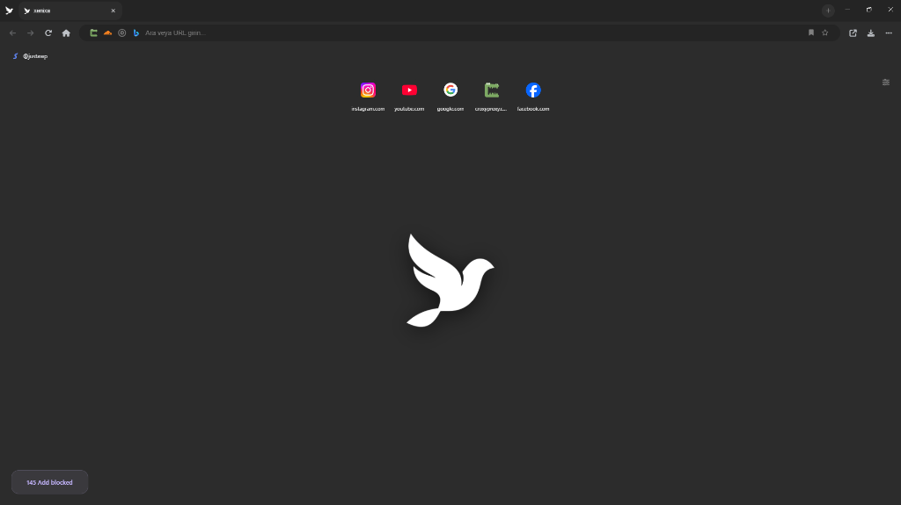

# Xenixa Browser



An Electron-based web browser integrated with a custom Chromium C++ engine.

## Features

- ✅ Electron-based application structure
- ✅ Custom C++ Chromium engine integration
- ✅ Tab system (browser-like tabs)
- ✅ Modern and sleek UI
- ✅ C++ integration via native bridge
- ✅ URL navigation
- ✅ Tab management (creation, closing, switching)

## Installation

```bash
# Install dependencies
npm install

# Compile native modules
npm run build-native

# Start the application
npm start
```

## Structure

```
xenixa/
├── electron/
│   ├── main.js           # Electron main process
│   ├── preload.js        # Preload script
│   └── native-bridge.js  # Native C++ bridge
├── native/
│   ├── xen_engine.h      # C++ header
│   ├── xen_engine.cpp    # C++ implementation
│   └── xen_webview.cpp   # WebView implementation
├── ui/
│   ├── index.html        # Main UI
│   ├── styles.css        # Stylesheet
│   └── renderer.js       # Renderer process
├── binding.gyp           # Node native binding config
└── package.json          # Node.js config
```

## Native C++ Engine

This project uses a custom C++ Chromium integration instead of using Electron's default behavior:

- `native/xen_engine.cpp`: Main engine implementation
- `native/xen_webview.cpp`: WebView integration
- `binding.gyp`: Native module build configuration

## Tab System

- Create new tabs (+ button)
- Close tabs (× button)
- Switch between active tabs
- Independent URL navigation for each tab

## Development

```bash
# Rebuild native modules
npm run rebuild

# Run Electron in development mode
npm start
```

## Notes

- Visual Studio Build Tools are required for compiling native modules (Windows)
- Node.js and npm must be installed
- Chromium C++ integration is under development
